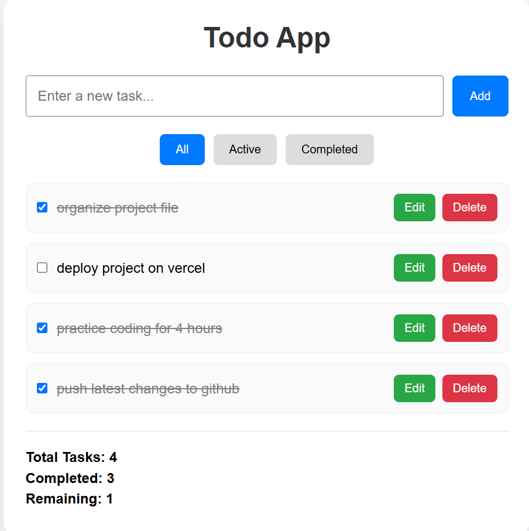

# React Todo App

## About the Project

This project is a Todo application developed with React and Vite. It was built to strengthen my understanding of React by implementing common features used in real applications. The focus of the project is on state management, user interaction, and building a clean, responsive interface.

## Features

- Add new tasks
- Edit existing tasks
- Delete tasks
- Mark tasks as completed
- Filter tasks by All, Active, and Completed
- Display total, completed, and remaining tasks
- Responsive layout

## Tech Stack

- React
- Vite
- JavaScript (ES6)
- CSS

## Project Preview

# Todo App - React




## Installation

Clone the repository:

```bash
git clone https://github.com/maryamishfaqqq/To-Do-List.git
```

Go to the project directory:

```bash
cd To-Do-List
```

Install dependencies:

```bash
npm install
```

Run the development server:

```bash
npm run dev
```

## Folder Structure

```
To-Do-List/
│── public/
│── src/
│── index.html
│── package.json
│── vite.config.js
└── README.md
```

## Future Improvements

- Store tasks in Local Storage
- Add search functionality
- Improve accessibility
- Add drag-and-drop task ordering

## Author

**Maryam Ashfaq**

GitHub: https://github.com/maryamishfaqqq